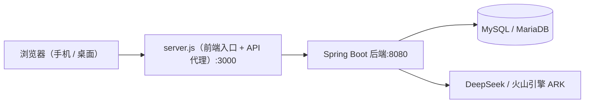
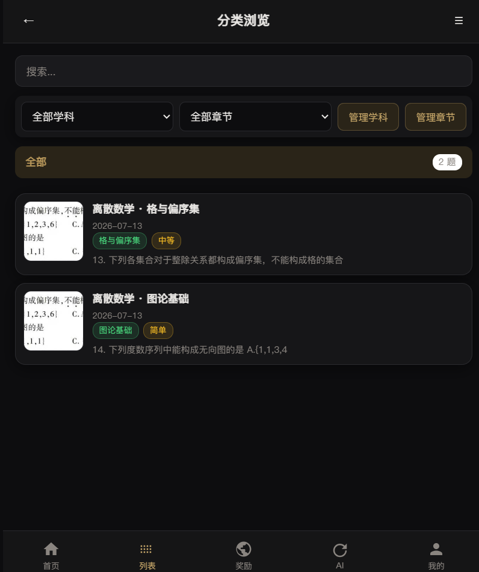
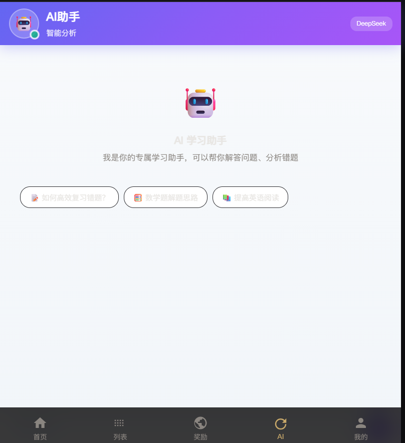
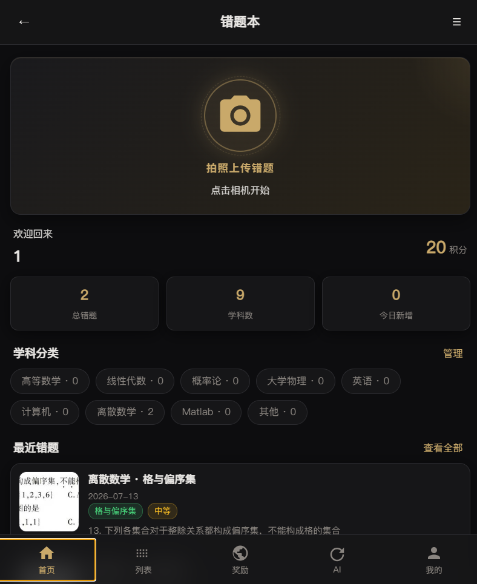

# 错题本应用（MistakeNote）

面向大学生的 **AI 错题整理与复习助手**：拍照/手动录入错题，自动识别学科与章节，AI 讲解分析，配合积分与徽章激励持续复习。

## 功能特性

- 用户注册 / 登录：JWT 认证 + BCrypt 密码加密
- 错题录入：拍照上传 + AI 文字识别（OCR）、手动填写、自动分类学科与章节
- 错题管理：按学科 / 章节 / 难度筛选，关键词搜索，编辑与删除
- AI 小助手：题目问答、错题分析、智能分类、专项练习生成
- 复习激励：积分、连续打卡、徽章系统、排行榜
- 响应式页面：适配手机、平板与桌面

## 技术栈

| 层 | 技术 |
| --- | --- |
| 前端 | HTML5 / CSS3 / 原生 JavaScript（SPA） |
| 后端 | Java 17 + Spring Boot 3.2 |
| 数据访问 | Spring Data JPA + Hibernate |
| 数据库 | MySQL / MariaDB |
| 安全 | Spring Security + JWT |
| AI | DeepSeek API（问答 / 分析 / 出题）+ 火山引擎 ARK（图片 OCR） |
| 部署 | Docker / Docker Compose |

## 系统架构



## 功能截图

> 截图请放到 `docs/screenshots/` 目录，然后在下面表格里引用（例如 ``）。

| 页面 | 截图 |
| --- | --- |
| 首页 |  |
| 错题列表 |  |
| AI 助手 |  |

## 在线体验

- 部署地址：`http://47.104.171.169:3000`（如有域名请替换）
- 测试账号：`student1 / 123456`（密码均为 `123456`）

## 本地运行

### 1. 准备数据库

安装并启动 MySQL / MariaDB，创建数据库 `mistakenote`。

### 2. 配置环境变量

复制 `.env.example` 为 `.env` 并填写（后端通过环境变量读取）：

```bash
cp .env.example .env
```

本地运行后端时，需要设置以下环境变量（PowerShell 示例）：

```powershell
$env:DB_PASSWORD='你的数据库密码'
$env:JWT_SECRET='至少32位的随机字符串'
$env:DEEPSEEK_API_KEY='你的 DeepSeek Key'   # 可选
$env:ARK_API_KEY='你的火山引擎 Key'          # 可选
```

### 3. 启动后端

```bash
cd springboot-backend
mvn spring-boot:run
```

后端运行在 `http://localhost:8080`。

### 4. 启动前端

```bash
npm install
npm start
```

打开浏览器访问 `http://localhost:3000`（前端会自动把 `/api/*` 请求转发到后端）。

## Docker 部署

```bash
# 1. 复制环境变量模板并填写
cp .env.example .env

# 2. 构建并启动（首次构建较慢）
docker compose up -d --build

# 3. 查看状态
docker compose ps
```

访问 `http://服务器IP:3000`。

## 项目结构

```
.
├── index.html / styles.css / app.js   # 前端页面、样式与交互
├── server.js                          # 前端入口服务器 + API 代理
├── springboot-backend/                # Spring Boot 后端
│   ├── controller/                    #   接口层（接单）
│   ├── service/                       #   业务逻辑层（做菜）
│   ├── repository/                    #   数据访问层（管仓库）
│   ├── entity/                        #   数据模型
│   ├── config/ filter/ util/ dto/     #   配置、鉴权、工具、传输对象
│   └── src/main/resources/            #   配置文件
├── scripts/                           # 数据与接口测试脚本
├── docs/                              # 项目文档（PRD / 技术架构）
├── docker-compose.yml                 # Docker 编排
└── .env.example                       # 环境变量模板（不提交真实密钥）
```

## 主要接口

| 模块 | 接口 |
| --- | --- |
| 认证 | `POST /api/auth/register`、`POST /api/auth/login`、`GET /api/auth/profile` |
| 错题 | `GET/POST /api/mistakes`、`GET/PUT/DELETE /api/mistakes/{id}`、`POST /api/mistakes/ocr` |
| 学科 | `GET/POST /api/subjects`、`GET/POST /api/subjects/{id}/chapters` |
| 奖励 | `GET /api/rewards/profile`、`/api/rewards/badges`、`/api/rewards/leaderboard` |
| AI | `POST /api/ai/ask`、`POST /api/ai/analyze`、`POST /api/ai/summary` |

## 配置说明

| 环境变量 | 说明 | 必填 |
| --- | --- | --- |
| `DB_PASSWORD` | 数据库密码 | ✅ |
| `JWT_SECRET` | JWT 签名密钥（至少 32 位随机字符串） | ✅ |
| `DEEPSEEK_API_KEY` | DeepSeek API Key（AI 问答 / 分析） | 可选 |
| `ARK_API_KEY` | 火山引擎 ARK API Key（图片 OCR） | 可选 |

## 注意事项

- **密钥只放在 `.env` 中，绝不提交到仓库**（`.env` 已被 `.gitignore` 忽略）
- 生产环境务必修改 `JWT_SECRET` 为随机强密钥
- 数据库连接请使用专用账号，避免使用 root + 弱密码

## 文档

- [产品需求文档 PRD](docs/PRD.md)
- [技术架构文档](docs/TECHNICAL_ARCHITECTURE.md)
- [项目差距分析](docs/GAP_ANALYSIS.md)
