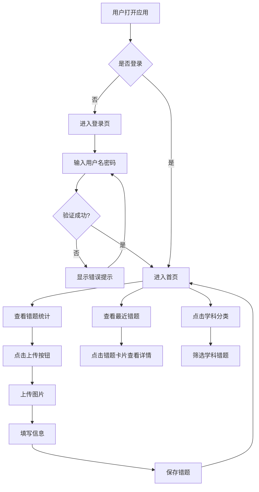

## 1. Product Overview

错题本应用是一款面向大学生的错题管理系统，帮助学生高效整理、分类和复习错题，结合AI助手提供智能分析和学习建议。

* 核心目标：提升学习效率，建立错题本习惯，通过奖励机制激励持续学习

* 目标用户：大学生、中学生等需要整理错题的学习者

## 2. Core Features

### 2.1 User Roles

| Role        | Registration Method | Core Permissions                                             |
| ----------- | ------------------- | ------------------------------------------------------------ |
| Normal User | Email registration  | Browse, add, manage mistakes; use AI assistant; view rewards |

### 2.2 Feature Module

1. **登录页**：用户注册、登录、密码验证
2. **首页**：用户信息、错题统计、最近错题列表、学科分类,你现在的等级
3. **上传页**：拍照上传、手动输入、科目选择,学科章节选择
4. **列表页**：错题列表、按学科/章节筛选、错题详情、删除编辑
5. **奖励页**：积分展示、徽章收集、排行榜、等级体系
6. **AI助手页**：AI问答、错题分析、智能分类、学习建议

### 2.3 Page Details

| Page Name | Module Name | Feature description        |
| --------- | ----------- | -------------------------- |
| 登录页       | 登录表单        | 用户名/密码输入、登录按钮、注册跳转、错误提示    |
| 登录页       | 注册表单        | 用户名/密码/邮箱输入、注册按钮、登录跳转、表单验证 |
| 首页        | 用户信息        | 显示用户名、积分、连续打卡天数            |
| 首页        | 统计面板        | 总错题数、学科数、今日添加数             |
| 首页        | 最近错题        | 显示最近5条错题卡片，点击查看详情          |
| 首页        | 学科分类        | 学科标签云，显示各学科错题数量            |
| 上传页       | 图片上传        | 拍照或选择图片上传错题                |
| 上传页       | 信息填写        | 学科选择、章节选择、难度设置、备注输入        |
| 上传页       | 自动识别        | AI自动识别学科和章节                |
| 列表页       | 错题列表        | 分页显示所有错题，支持按学科筛选           |
| 列表页       | 错题卡片        | 显示错题图片、学科、章节、难度、时间         |
| 列表页       | 筛选功能        | 按学科、章节、难度筛选                |
| 奖励页       | 用户概览        | 积分、等级、等级称号、连续打卡            |
| 奖励页       | 徽章收集        | 徽章列表，已获得/未获得状态             |
| 奖励页       | 排行榜         | 积分排行榜，显示前10名用户             |
| AI助手页     | 问答界面        | 输入框、发送按钮、回答展示区             |
| AI助手页     | 功能选择        | 问答、错题分析、智能分类、学习总结          |

## 3. Core Process

### 用户登录流程

用户进入登录页 → 输入用户名密码 → 验证成功 → 跳转首页 → 加载数据

### 添加错题流程

点击上传按钮 → 进入上传页 → 上传图片或输入内容 → 选择学科章节 → 设置难度 → 保存 → 返回首页

### AI问答流程

进入AI助手页 → 输入问题 → 发送请求 → 显示AI回答 → 可继续追问

## 4. User Interface Design

### 4.1 Design Style

* **主色调**：#4A90D9（蓝色系，代表知识和智慧）

* **辅助色**：#52C41A（绿色，成功状态）、#FF6B6B（红色，错误/删除）、#FFC107（黄色，警告/积分）

* **按钮风格**：圆角矩形（border-radius: 8px），渐变背景，hover效果

* **字体**：系统默认字体，中文使用微软雅黑/思源黑体

* **字号**：标题18-24px，正文14px，辅助文字12px

* **布局风格**：卡片式布局，清晰的信息层级

* **图标风格**：线性图标，统一24px尺寸

### 4.2 Page Design Overview

| Page Name | Module Name | UI Elements               |
| --------- | ----------- | ------------------------- |
| 登录页       | 登录表单        | 白色卡片容器、输入框（带图标）、圆角按钮、链接文字 |
| 首页        | 用户信息        | 顶部导航栏、用户头像、用户名、积分徽章       |
| 首页        | 统计面板        | 三个统计卡片，数字大字体，图标+文字        |
| 首页        | 最近错题        | 横向滚动卡片列表，图片+学科标签+时间       |
| 首页        | 学科分类        | 标签云形式，彩色圆角标签              |
| 上传页       | 上传区域        | 虚线边框上传区，点击上传提示，预览图        |
| 上传页       | 表单区域        | 下拉选择框、单选按钮、文本输入框          |
| 列表页       | 筛选栏         | 学科下拉、搜索框                  |
| 列表页       | 错题列表        | 网格布局卡片，图片占比60%，信息占比40%    |
| 奖励页       | 用户概览        | 大圆形等级图标、积分数字、等级称号         |
| 奖励页       | 徽章收集        | 网格布局徽章图标，已获得高亮，未获得灰色      |
| 奖励页       | 排行榜         | 列表项，排名数字、用户名、积分、打卡天数      |
| AI助手页     | 问答界面        | 顶部标题、输入区域（底部固定）、消息气泡列表    |

### 4.3 Responsiveness

* **移动端优先**：适配手机屏幕（375px+），使用弹性布局

* **平板适配**：中等屏幕优化显示密度

* **桌面适配**：大屏幕保持布局完整性，增加留白

* **触摸优化**：按钮最小点击区域44px，卡片间距合理

### 4.4 交互细节

* 页面切换带淡入动画

* 按钮点击带缩放反馈

* 表单验证实时提示

* Toast消息提示操作结果

* 下拉刷新支持

