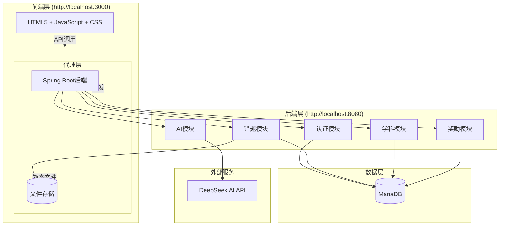
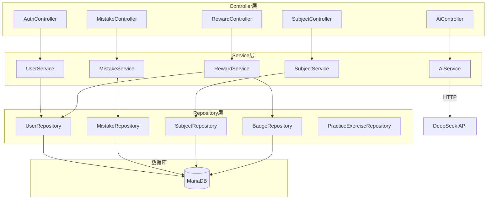
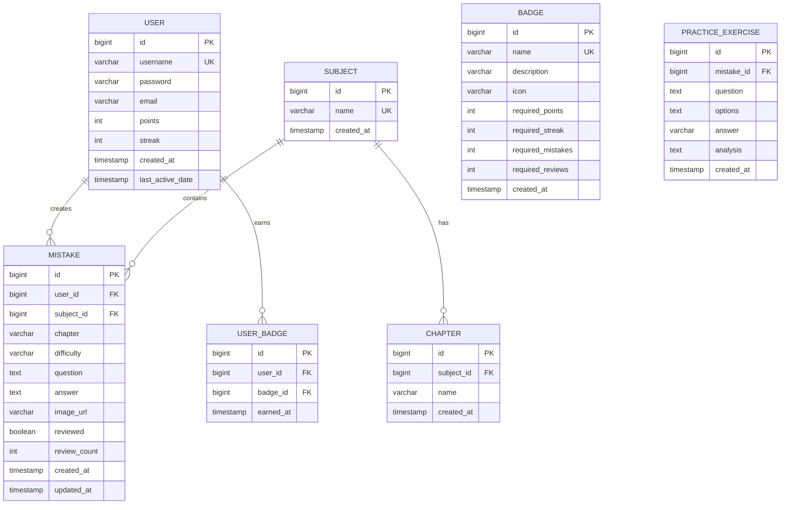

## 1. Architecture Design



## 2. Technology Description

### 2.1 前端技术栈

| 技术                | 版本      | 用途             |
| ----------------- | ------- | -------------- |
| HTML5             | -       | 页面结构           |
| JavaScript (ES6+) | -       | 前端逻辑           |
| CSS3              | -       | 样式设计           |
| Express           | ^4.19.2 | 静态资源服务 + API代理 |

### 2.2 后端技术栈

| 技术              | 版本     | 用途    |
| --------------- | ------ | ----- |
| Spring Boot     | 3.2.5  | 后端框架  |
| Java            | 17     | 编程语言  |
| Spring Security | -      | 安全框架  |
| Spring Data JPA | -      | 数据访问  |
| JJWT            | 0.12.5 | JWT认证 |
| MariaDB         | 10.x   | 数据库   |

### 2.3 外部服务

| 服务           | 用途        |
| ------------ | --------- |
| DeepSeek API | AI问答、错题分析 |

## 3. Route Definitions

### 前端路由（SPA）

| Route           | Purpose        | Component/View |
| --------------- | -------------- | -------------- |
| `/`             | 默认路由，重定向到登录或首页 | -              |
| `/login`        | 登录页面           | view-login     |
| `/register`     | 注册页面           | view-register  |
| `/home`         | 首页             | view-home      |
| `/upload`       | 上传错题页面         | view-upload    |
| `/list`         | 错题列表页面         | view-list      |
| `/detail/:id`   | 错题详情页面         | view-detail    |
| `/rewards`      | 奖励中心页面         | view-rewards   |
| `/ai`           | AI助手页面         | view-ai        |
| `/manage/:type` | 学科/章节管理页面      | view-manage    |

## 4. API Definitions

### 4.1 认证接口

#### POST /api/auth/register

**请求体：**

```json
{
  "username": "string (必填, 3-20字符)",
  "password": "string (必填, 6-20字符)",
  "email": "string (必填, 邮箱格式)"
}
```

**响应：**

```json
{
  "user": {
    "id": "number",
    "username": "string",
    "email": "string",
    "points": "number",
    "streak": "number"
  },
  "token": "string (JWT令牌)"
}
```

#### POST /api/auth/login

**请求体：**

```json
{
  "username": "string (必填)",
  "password": "string (必填)"
}
```

**响应：** 同注册成功响应

#### GET /api/auth/profile

**请求头：** `Authorization: Bearer <token>`

**响应：**

```json
{
  "id": "number",
  "username": "string",
  "email": "string",
  "points": "number",
  "streak": "number",
  "createdAt": "timestamp"
}
```

### 4.2 错题接口

#### GET /api/mistakes

**请求头：** `Authorization: Bearer <token>`

**请求参数：**

* `subjectId`: number (可选，学科ID)

* `page`: number (可选，页码)

* `size`: number (可选，每页数量)

**响应：**

```json
[
  {
    "id": "number",
    "subjectId": "number",
    "chapter": "string",
    "difficulty": "string (简单/中等/困难)",
    "question": "string",
    "answer": "string",
    "imageUrl": "string (可选)",
    "createdAt": "timestamp",
    "reviewed": "boolean",
    "reviewCount": "number"
  }
]
```

#### POST /api/mistakes

**请求头：** `Authorization: Bearer <token>`

**请求体：**

```json
{
  "subjectId": "number (必填)",
  "chapter": "string (必填)",
  "difficulty": "string (必填, 简单/中等/困难)",
  "question": "string (必填)",
  "answer": "string (可选)",
  "imageUrl": "string (可选)"
}
```

**响应：** 返回创建的错题对象

#### GET /api/mistakes/:id

**请求头：** `Authorization: Bearer <token>`

**响应：** 错题详情对象

#### PUT /api/mistakes/:id

**请求头：** `Authorization: Bearer <token>`

**请求体：** 同创建接口（所有字段可选）

**响应：** 更新后的错题对象

#### DELETE /api/mistakes/:id

**请求头：** `Authorization: Bearer <token>`

**响应：** `{ "message": "删除成功" }`

### 4.3 学科接口

#### GET /api/subjects

**请求头：** `Authorization: Bearer <token>`

**响应：**

```json
[
  {
    "id": "number",
    "name": "string"
  }
]
```

#### POST /api/subjects

**请求头：** `Authorization: Bearer <token>`

**请求体：**

```json
{
  "name": "string (必填, 学科名称)"
}
```

**响应：** 返回创建的学科对象

#### DELETE /api/subjects/:id

**请求头：** `Authorization: Bearer <token>`

**响应：** `{ "message": "删除成功" }`

#### GET /api/subjects/:id/chapters

**请求头：** `Authorization: Bearer <token>`

**响应：**

```json
[
  {
    "id": "number",
    "subjectId": "number",
    "name": "string"
  }
]
```

#### POST /api/subjects/:id/chapters

**请求头：** `Authorization: Bearer <token>`

**请求体：**

```json
{
  "chapter": "string (必填, 章节名称)"
}
```

**响应：** 返回创建的章节对象

### 4.4 奖励接口

#### GET /api/rewards/profile

**请求头：** `Authorization: Bearer <token>`

**响应：**

```json
{
  "points": "number",
  "level": "number",
  "levelTitle": "string",
  "streak": "number"
}
```

#### GET /api/rewards/badges

**请求头：** `Authorization: Bearer <token>`

**响应：**

```json
{
  "data": [
    {
      "id": "number",
      "name": "string",
      "description": "string",
      "icon": "string",
      "unlocked": "boolean"
    }
  ]
}
```

#### GET /api/rewards/leaderboard

**请求头：** `Authorization: Bearer <token>`

**响应：**

```json
{
  "data": [
    {
      "username": "string",
      "points": "number",
      "streak": "number"
    }
  ]
}
```

### 4.5 AI接口

#### POST /api/ai/ask

**请求头：** `Authorization: Bearer <token>`

**请求体：**

```json
{
  "question": "string (必填, 用户问题)"
}
```

**响应：**

```json
{
  "answer": "string",
  "source": "string"
}
```

#### POST /api/ai/generate-practice

**请求头：** `Authorization: Bearer <token>`

**请求体：**

```json
{
  "errorPoint": "string (必填, 知识点)",
  "errorType": "string (必填, 错误类型)"
}
```

**响应：**

```json
{
  "message": "string",
  "exercises": [
    {
      "question": "string",
      "options": ["string", "string", "string", "string"],
      "answer": "string",
      "analysis": "string"
    }
  ]
}
```

## 5. Server Architecture Diagram



## 6. Data Model

### 6.1 Data Model Definition



### 6.2 Data Definition Language

#### 用户表 (users)

```sql
CREATE TABLE users (
    id BIGINT PRIMARY KEY AUTO_INCREMENT,
    username VARCHAR(50) NOT NULL UNIQUE,
    password VARCHAR(255) NOT NULL,
    email VARCHAR(100) NOT NULL,
    points INT DEFAULT 0,
    streak INT DEFAULT 0,
    created_at TIMESTAMP DEFAULT CURRENT_TIMESTAMP,
    last_active_date TIMESTAMP NULL
);
```

#### 学科表 (subjects)

```sql
CREATE TABLE subjects (
    id BIGINT PRIMARY KEY AUTO_INCREMENT,
    name VARCHAR(50) NOT NULL UNIQUE,
    created_at TIMESTAMP DEFAULT CURRENT_TIMESTAMP
);
```

#### 章节表 (chapters)

```sql
CREATE TABLE chapters (
    id BIGINT PRIMARY KEY AUTO_INCREMENT,
    subject_id BIGINT NOT NULL,
    name VARCHAR(100) NOT NULL,
    created_at TIMESTAMP DEFAULT CURRENT_TIMESTAMP,
    FOREIGN KEY (subject_id) REFERENCES subjects(id) ON DELETE CASCADE,
    UNIQUE KEY (subject_id, name)
);
```

#### 错题表 (mistakes)

```sql
CREATE TABLE mistakes (
    id BIGINT PRIMARY KEY AUTO_INCREMENT,
    user_id BIGINT NOT NULL,
    subject_id BIGINT NOT NULL,
    chapter VARCHAR(100),
    difficulty VARCHAR(20) NOT NULL,
    question TEXT NOT NULL,
    answer TEXT,
    image_url VARCHAR(255),
    reviewed BOOLEAN DEFAULT FALSE,
    review_count INT DEFAULT 0,
    created_at TIMESTAMP DEFAULT CURRENT_TIMESTAMP,
    updated_at TIMESTAMP DEFAULT CURRENT_TIMESTAMP ON UPDATE CURRENT_TIMESTAMP,
    FOREIGN KEY (user_id) REFERENCES users(id) ON DELETE CASCADE,
    FOREIGN KEY (subject_id) REFERENCES subjects(id) ON DELETE CASCADE
);
```

#### 徽章表 (badges)

```sql
CREATE TABLE badges (
    id BIGINT PRIMARY KEY AUTO_INCREMENT,
    name VARCHAR(50) NOT NULL UNIQUE,
    description VARCHAR(200),
    icon VARCHAR(100),
    required_points INT DEFAULT 0,
    required_streak INT DEFAULT 0,
    required_mistakes INT DEFAULT 0,
    required_reviews INT DEFAULT 0,
    created_at TIMESTAMP DEFAULT CURRENT_TIMESTAMP
);
```

#### 用户徽章关联表 (user\_badges)

```sql
CREATE TABLE user_badges (
    id BIGINT PRIMARY KEY AUTO_INCREMENT,
    user_id BIGINT NOT NULL,
    badge_id BIGINT NOT NULL,
    earned_at TIMESTAMP DEFAULT CURRENT_TIMESTAMP,
    FOREIGN KEY (user_id) REFERENCES users(id) ON DELETE CASCADE,
    FOREIGN KEY (badge_id) REFERENCES badges(id) ON DELETE CASCADE,
    UNIQUE KEY (user_id, badge_id)
);
```

#### 练习题目表 (practice\_exercises)

```sql
CREATE TABLE practice_exercises (
    id BIGINT PRIMARY KEY AUTO_INCREMENT,
    mistake_id BIGINT NOT NULL,
    question TEXT NOT NULL,
    options TEXT NOT NULL,
    answer VARCHAR(10) NOT NULL,
    analysis TEXT,
    created_at TIMESTAMP DEFAULT CURRENT_TIMESTAMP,
    FOREIGN KEY (mistake_id) REFERENCES mistakes(id) ON DELETE CASCADE
);
```

#### 索引

```sql
-- 用户表索引
CREATE INDEX idx_users_username ON users(username);

-- 错题表索引
CREATE INDEX idx_mistakes_user_id ON mistakes(user_id);
CREATE INDEX idx_mistakes_subject_id ON mistakes(subject_id);
CREATE INDEX idx_mistakes_created_at ON mistakes(created_at);

-- 用户徽章索引
CREATE INDEX idx_user_badges_user_id ON user_badges(user_id);
```

#### 初始数据

```sql
-- 初始学科
INSERT INTO subjects (name) VALUES 
('高等数学'), ('大学物理'), ('英语'), ('线性代数'), ('计算机基础');

-- 初始徽章
INSERT INTO badges (name, description, icon, required_points, required_streak, required_mistakes, required_reviews) VALUES 
('坚持不懈', '连续打卡3天', '🔥', 0, 3, 0, 0),
('一周达人', '连续打卡7天', '⭐', 0, 7, 0, 0),
('月冠军', '连续打卡30天', '👑', 0, 30, 0, 0),
('错题新手', '添加1道错题', '📝', 0, 0, 1, 0),
('错题能手', '添加50道错题', '📚', 0, 0, 50, 0),
('错题大师', '添加100道错题', '🎯', 0, 0, 100, 0),
('勤学好问', '复习10次', '🔄', 0, 0, 0, 10),
('学霸养成', '复习50次', '💯', 0, 0, 0, 50);
```

